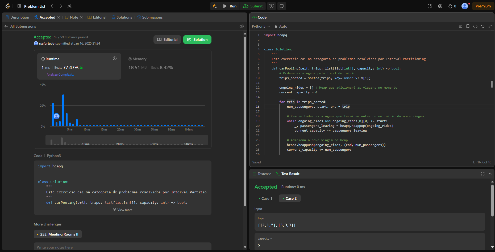

# Exercícios do Juiz Online LeetCode

**Número da Lista**: 49 
**Conteúdo da Disciplina**: Algoritmos Ambiciosos 

## Alunos
|Matrícula | Aluno |
| -- | -- |
| 17/0008291  |  Cristian Furtado |
| 21/1041043 |  Juan Pablo |

## Sobre 
Serão realizados 3 exercícios na plataforma no LeetCode que são:

- <a href="https://leetcode.com/problems/car-pooling/description/">1094. Carona solidária (Médio)</a>
- <a href="https://leetcode.com/problems/race-car/description/">0818. Carro de corrida (Difícil)</a>
- <a href="https://leetcode.com/problems/strong-password-checker/description/">0420. Checagem de senha forte (Difícil)</a>
- <a href="https://leetcode.com/problems/candy/description/">0135. Doces (Difícil)</a>

## Screenshots

## Instalação 
**Linguagem**: Python 3.10.* 

Necessário ter instalado na máquina versão do Python 3.10.* para que sejam executados os exercícios e uma conta no site LeetCode.

## Uso 
Explique como usar seu projeto caso haja algum passo a passo após o comando de execução.

## Outros 
Quaisquer outras informações sobre seu projeto podem ser descritas abaixo.

## Links dos vídeos com explicação

[Exercício 1094](https://drive.google.com/file/d/1QMguM_H9QBFOXIbuD03TLwHS5O-KQG6U/view?usp=sharing)

